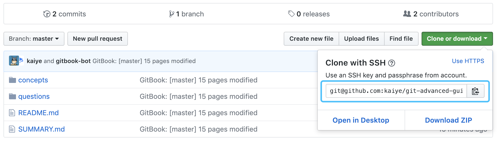

# Git SSH Keys 配置

在执行 git pull / push 时，需要相应的用户权限，如果使用远程仓库的 HTTPS 地址，则每次同步都需要输入用户名密码。

**因此，从安全性和便利性的角度考虑，应当始终使用远程仓库的 SSH 地址。**



这就要求我们进行 SSH Keys 的配置。SSH 密钥对包含一组「私钥」和「公钥」，私钥存在用户本地，公钥存放在远程主机。

Git 服务提供商（Github、Gitlab 等）会在用户设置界面提供一个录入用户公钥的入口，我们只需将生成好的公钥提交保存上去，即可实现免密 git pull / push。

## 1、生成 SSH 私钥、公钥对

```shell
# 运行密钥生成命令，一路回车
ssh-keygen
```

注：`ssh-keygen` 命令有诸多参数用法，如果你使用 `-f` 参数项指定了密钥对的名称，那么在 macOS 上还需要使用 `ssh-add` 命令将密钥对加入 SSH agent 中，或者在 SSH config 文件中配置主机和密钥的使用。

```shell
ssh-keygen -f ~/.ssh/github
ssh-add -K ~/.ssh/github
```

## 2、复制公钥信息

SSH 默认私钥地址为：`~/.ssh/id_rsa` ，对应的公钥为：`~/.ssh/id_rsa.pub`，使用编辑器或 `cat` 命令输出公钥内容拷贝至剪贴板，然后将公钥粘贴至对应的配置后台。如，Github 的地址为 [https://github.com/settings/keys](https://github.com/settings/keys)

```shell
cat ~/.ssh/id_rsa.pub
```

## 3、测试 SSH 是否连接成功

```shell
ssh -T git@github.com # 这里以 Github 服务为例
```

